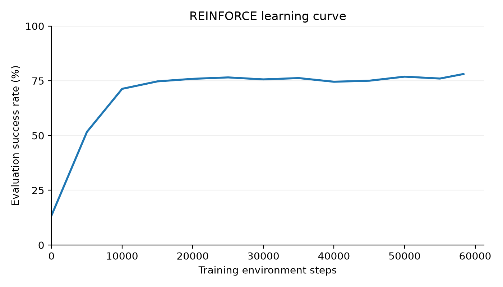
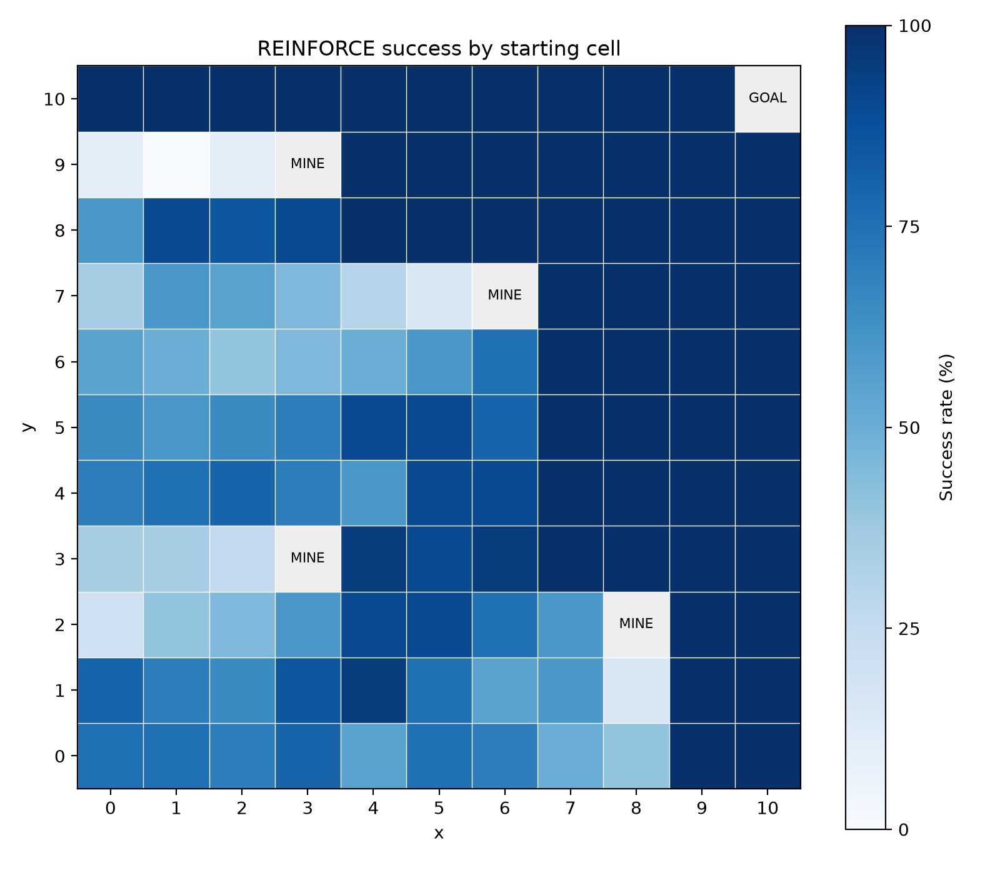
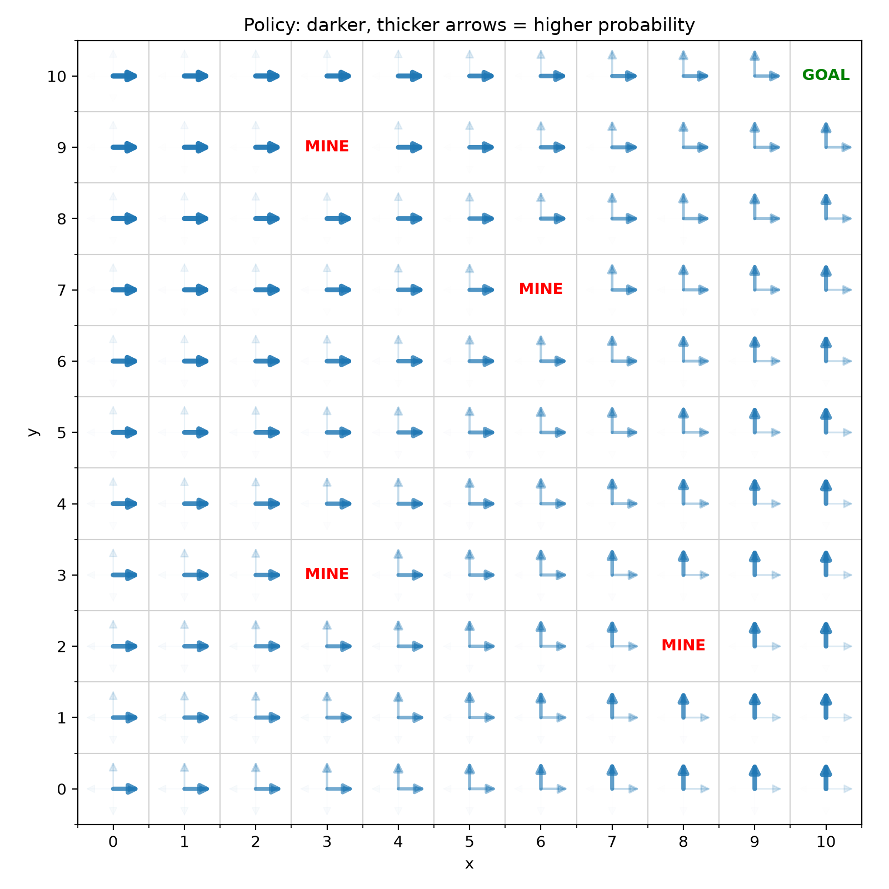

# RL from scratch
## Description
Building RL fundamentals from scratch with implementations of the following algorithms in a simple grid search environment
- REINFORCE
- Actor-Critic
- PPO

## Experiment setup

The agent moves up, down, left, or right in an 11×11 grid with 4 fixed mines, a random safe starting cell, and a goal at (10, 10). Reaching the goal gives +1, hitting a mine gives −1, and attempting to leave the grid gives −0.1. Episodes end at the goal, a mine, or after 200 steps.

## Reinforce algorithm

Derivations can be found [here](derivations/reinforce/RL_policy_gradient_derivation.pdf).

### Results

<table>
  <tr>
    <td align="center">Success rate by starting cell</td>
    <td align="center">Visualizing the learned policy</td>
  </tr>
  <tr>
    <td>
      
    </td>
    <td>
      
    </td>
  </tr>
</table>